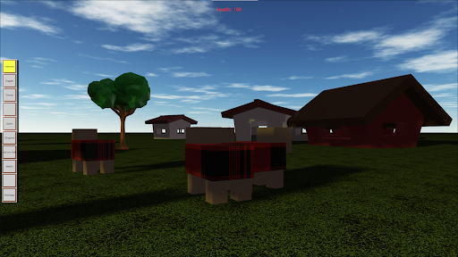
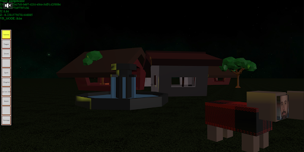
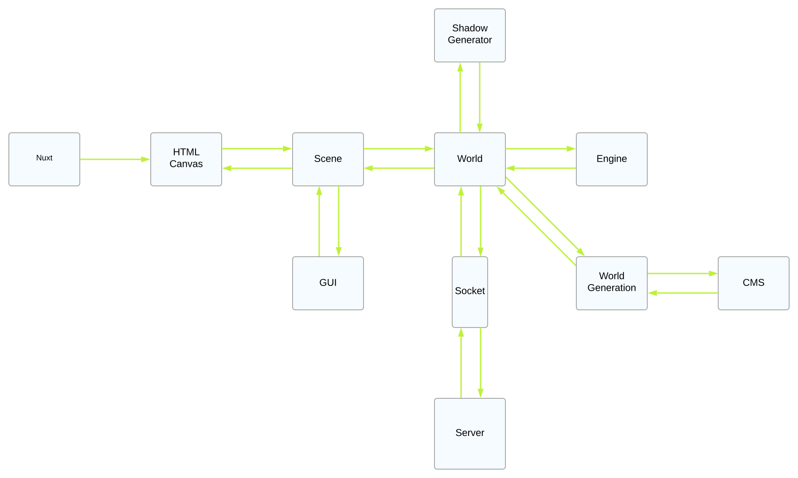

# Skrunkle

Skrunkle is an online game developed by high school students. The premise of Skrunkle is to stay alive for as long as possible with the given tools. This project includes VR integration.

# Description

Skrunkle has been developed with frameworks such as BabylonJS, TypeScript, Vue, and NuxtJS. The game has many different features which includes immersive audio, realistic physics applications, day/night cycles, and random generation of structures. We hope to continue to grow this application with features such as authentication of specific users and saving progress.
\




# Setup and Install

Three different servers are required to run this project. Ensure that you have set the correct URL for the CMS server in `.\nuxt-client\nuxt.config.ts` and `.\server\.env` Ensure that you have set the correct URL for the Websocket in `.\nuxt-client\nuxt.config.ts` Ports for locally hosting the CMS and Websocket servers are displayed on server start. The project requires you to have nodeJS preinstalled. To run the project,

1. Change the directory to nuxt-client folder in the first terminal
   ```linux
    C:\Users\Projects\Skrunkle> cd nuxt-client
   ```
2. Install dependencies with “npm i”
   ```linux
    C:\Users\Projects\Skrunkle\nuxt-client> npm i
   ```
3. Run server with “npm run dev”
   ```linux
   C:\Users\Projects\Skrunkle\nuxt-client> npm run dev
   ```
4. Open two more terminals with directories “cms” and “server”. Repeat steps 2 and 3
   ```linux
    C:\Users\Projects\Skrunkle> cd cms
   ```
   ```linux
    C:\Users\Projects\Skrunkle> cd server
   ```
5. To build project, use “npm run build”
   ```linux
   C:\Users\Projects\Skrunkle> npm run build
   ```

# Functionality



Further documentation is provided throughout the project directory.

# Documentation

Navigate through these READMEs to understand the functions and classes we implemented in this project.

**Client:**
- [Src](/nuxt-client/src/README.md) 
- [World](/nuxt-client/src/world/README.md)
- [GUI](/nuxt-client/src/gui/README.md)
- [Entity](/nuxt-client/src/entity/README.md) 

**Server:**
- [Src](/server/src/README.md) 
- [Entity](/server/src/entity/README.md) 

# Credits

[Youwei Zhen](https://youweizhen.com)\
*https://github.com/AntoDono*

[Edwin Wright](https://codewright.tech)\
*https://github.com/ewright516*

[Thomas Anderson](https://Thomas-anderson-2024.netlify.app)\
*https://github.com/Thomas-Anderson2024*

[Ashley Chan](https://ashleyspersonalresume.netlify.app)\
*https://github.com/ashleychchan*

Michelle Chao\
*https://github.com/MichelleO3O*
