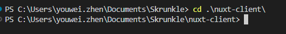
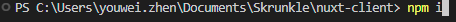
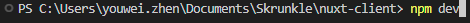
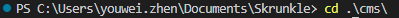
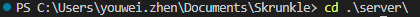

# Skrunkle

Skrunkle is an online game developed by high school students. The premise of Skrunkle is to stay alive for as long as possible with the given tools. This project includes VR integration.

# Description

Skrunkle has been developed with frameworks such as BabylonJS, TypeScript, Vue, and NuxtJS. The game has many different features which includes immersive audio, realistic physics applications, day/night cycles, random generation of structures, and entity pickup and drop. We hope to continue to grow this application with features such as authentication of specific users and saving progress.

# Install

Three different servers are required to run this project. The project requires you to have nodeJS preinstalled. To run the project,

1. Change the directory to nuxt-client folder in the first terminal
   
2. Install dependencies with “npm i”
   
3. Run server with “npm run dev”
   
4. Open two more terminals with directories “cms” and “server”. Repeat steps 2 and 3
   
   
5. To build project, use “npm run build”

# Credits

[Youwei Zhen](https://youweizhen.com)
https://github.com/AntoDono

[Edwin Wright](https://codewright.tech)
https://github.com/ewright516

[Thomas Anderson](https://Thomas-anderson-2024.netlify.app)
https://github.com/Thomas-Anderson2024

[Ashley Chan](https://ashleyspersonalresume.netlify.app)
https://github.com/ashleychchan

Michelle Chao
https://github.com/MichelleO3O
